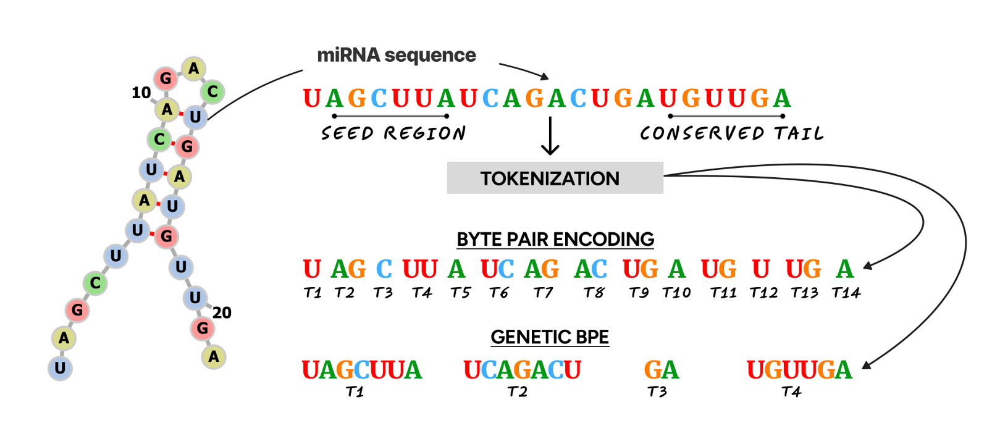
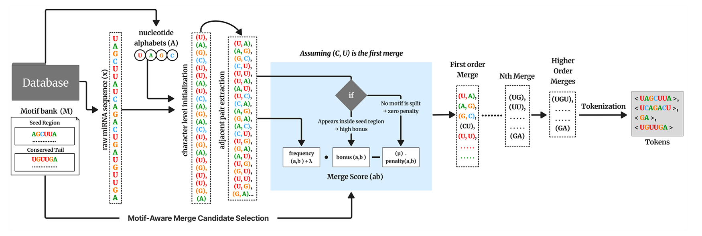

# GeneticBPE: Motif-Preserving Tokenization for Robust miRNA Modeling

GeneticBPE is a biologically-informed tokenization framework that preserves structural motifs in biological sequences while maintaining compression efficiency. This implementation is based on the paper "GeneticBPE: Motif-Preserving Tokenization for Robust miRNA Modeling".

---

## Features

- Motif-aware tokenization for biological sequences
- Preservation of conserved regions and seed motifs
- Efficient compression while maintaining biological relevance
- Support for miRNA sequence processing
- Cross-species generalization capabilities

---

## Visual Overview


*Figure: Motif-aware tokenization process, showing how biological motifs are preserved during encoding.*

---

## Architecture Overview

- **MotifBank**: Only core motif rules (e.g., seed/conserved) are hardcoded in Python. All other motifs are loaded from and saved to a CSV file. MotifBank supports dynamic add, update, remove, and persistent save/load of motifs.
- **MotifSpanManager**: Handles motif span finding and boundary logic. Used by the tokenizer to check if merges are motif-preserving.
- **GeneticBPETokenizer**: Loads motif_weight (lambda) and penalty_weight (mu) from a config file (`genetic_bpe_config.json`). These parameters are not hardcoded and can be updated at runtime.

---

## Configuration

The motif-aware merge parameters are set in `genetic_bpe_config.json`:

```json
{
  "motif_weight": 2.5,
  "penalty_weight": 10.0
}
```

You can update these values and reload them at runtime:

```python
from genetic_bpe import GeneticBPETokenizer

tokenizer = GeneticBPETokenizer(config_path="genetic_bpe/genetic_bpe_config.json")
# ...
tokenizer.reload_config()  # Reloads lambda and mu from config file
```

---

## Usage

```python
from genetic_bpe import GeneticBPETokenizer

# Initialize tokenizer (loads lambda/mu from config)
tokenizer = GeneticBPETokenizer(
    vocab_size=512,
    min_freq=2,
    config_path="genetic_bpe/genetic_bpe_config.json"
)

# Train tokenizer
sequences = ["AUGCAUGCAUGC", ...]
tokenizer.train(sequences)

# Tokenize sequences
tokens = tokenizer.tokenize("AUGCAUGCAUGC")
```

---

## Project Structure

```
genetic_bpe/
├── genetic_bpe/
│   ├── __init__.py
│   ├── tokenizer.py
│   ├── motif_bank.py
│   └── utils.py
├── tests/
│   └── test_tokenizer.py
├── examples/
│   └── basic_usage.py
├── requirements.txt
└── README.md
```

## License

MIT License

## Authors

Jaskaran Singh*¹², Prabhav Sanga*³², Arun Kumar Dubey⁴²  
*Equal contribution  
¹ Department of Computational Biology, Institute 1  
² Center for Genomic Research, Institute 2  
³ Department of Computer Science, Institute 3  
⁴ Department of Bioinformatics, Institute 4

---

## Publication & Citation

Accepted in: **Proceedings of the ICML 2025 Tokenization Workshop (TokShop)**, Vancouver, Canada. PMLR 267, 2025.  
Copyright 2025 by the author(s).

If you use GeneticBPE in your research, please cite:

```
@inproceedings{singh2025geneticbpe,
  title={GeneticBPE: Motif-Preserving Tokenization for Robust miRNA Modeling},
  author={Jaskaran Singh and Prabhav Sanga and Arun Kumar Dubey},
  booktitle={Proceedings of the ICML 2025 Tokenization Workshop (TokShop)},
  series={Proceedings of Machine Learning Research},
  volume={267},
  year={2025},
  address={Vancouver, Canada},
  publisher={PMLR}
}
```
